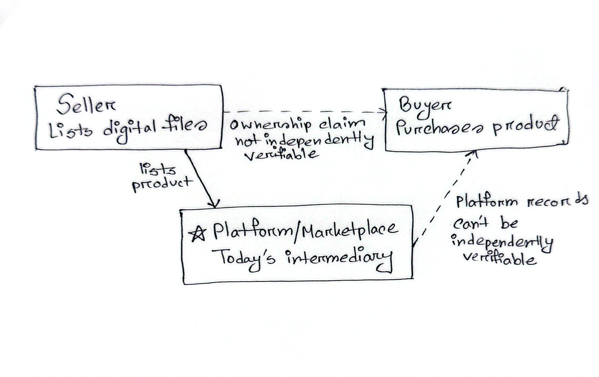
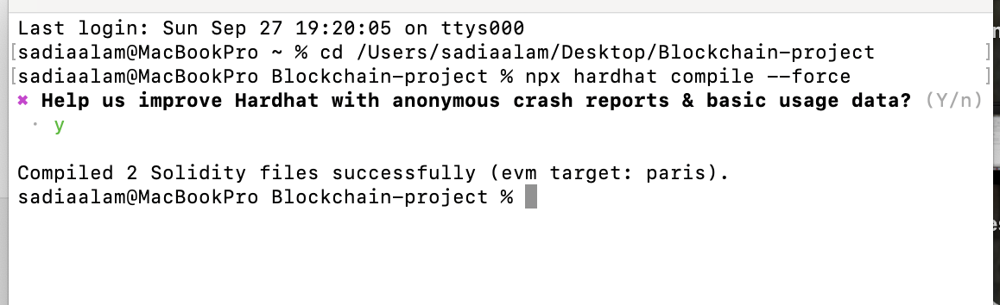
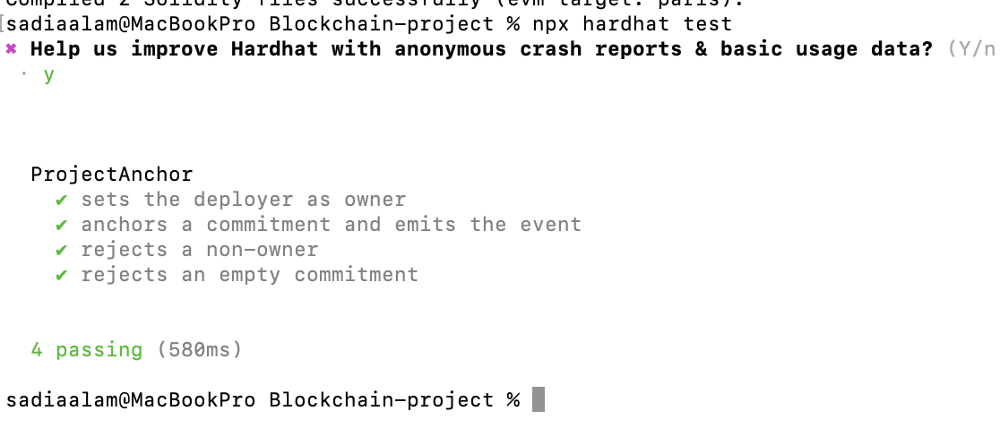
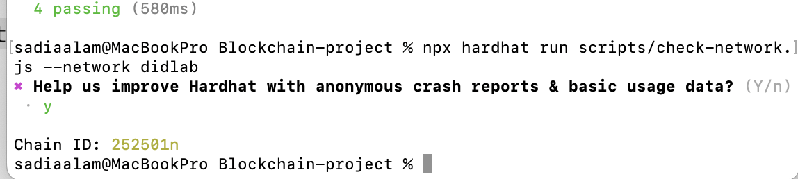

# Milestone 1

## Part A

### A1: Problem Statement

When a buyer buys digital products such as images, videos, or files online, they cannot independently confirm whether the file is unaltered or verify its ownership history. Creators need to depend on centralized platforms to maintain registrations, and buyers need to rely on centralized platforms such as marketplaces to verify the product's integrity. However, the records on centralized platforms may not be independently verifiable outside the platform. If there is any issue with the marketplace, such as losing data, displaying a wrong listing, or shutting down, there is no independent way to check the history. Participants are required to trust the platform's records.

This dependency can make independent verification difficult when disputes occur or when records need to be checked outside the platform.

### A2: Stakeholder, Asset, and Transaction Map

| Element | Answer |
| --- | --- |
| **Stakeholders** | **Registrant/Seller:** registers their digital work.  **Platform/marketplace:** where registration and selling/buying happen. It manages product listings, sales, and transaction records in the current system. |
| **Assets** | The digital product (a digital file, such as an image or video), the hash anchored on-chain, and the transfer record. |
| **Transactions** | The verifier attests that a creator's address is identity-checked. The creator registers the digital product. The buyer gets the product from the creator. Ownership is transferred. |
| **Records** | The seller's account, marketplace listing page, resale history, and possibly a "Verified" badge issued at the platform's discretion. All are held, decided, and controlled by the platform. |
| **Current intermediary** | The platform/marketplace. Sellers register their products here, and the platform decides whether a seller's identity is valid. It privately holds all sale and transfer history. |
| **What goes wrong** | A verified badge can only check the legitimacy of the seller's identity. It does not confirm whether the authentic seller created the listed work. A buyer cannot know whether the product is a stolen copy. Ownership and resale history live only in the platform's private database. |

### A3: Trust Boundary Diagram

## Part B

### B1: Qualifiers

| ID | Question | Answer | Justification |
| --- | --- | --- | --- |
| Q1 | Multiple parties who do not fully trust each other act on the same data | Yes | The three parties - sellers, buyers, and the marketplace - interact with each other for the same digital product. The buyer may not fully trust the seller or the marketplace's records regarding registration or ownership history. |
| Q2 | Multiple parties need to write, not only read | Yes | The seller initially registers the product, but the buyer can become a seller later. Therefore, writing is not confined to one party. |
| Q3 | A trusted intermediary's cost, delay, failure risk, or power is itself the problem | Yes | The marketplace acts as the current intermediary and maintains the transaction records. Because participants cannot independently verify these records, they depend on the marketplace's records. |
| Q4 | Someone must verify a claim without trusting the claimant | Yes | The buyer should be able to verify the digital product without relying only on the seller's claims. The buyer can recompute the file hash and compare it with the publicly recorded on-chain commitment. Thus, the buyer can verify the claim independently. |
| Q5 | The record must remain tamper-evident after the fact | Yes | People may need to look back, and a dishonest seller or platform might benefit from changing or deleting evidence. Therefore, records must remain verifiable so future owners can confirm a digital file's integrity and ownership history years later. |

### B2: Disqualifiers

| ID | Disqualifier | Applies? | How Our Design Handles It |
| --- | --- | --- | --- |
| D1 | Requires confidential content readable on-chain | No, by design | Digital files, marketplace listings, payment information, and identities remain off-chain. Only the hashed fingerprint and ownership/transfer records go on-chain. Personal identifiers do not belong on-chain. |
| D2 | Requires throughput or finality beyond approximately two-second blocks | No | Registrations and transfers depend on the pace of a registrant publishing work and completing sales. The system does not require thousands of writes per second or sub-second finality. |
| D3 | Requires large data on-chain | No, by design | Rather than storing files on-chain, the system stores only their cryptographic hashes. Anyone can re-hash a file and compare it with the anchored value to determine whether it has been altered. The candidate problem passes with the anchoring pattern already built into the design. |
| D4 | All critical facts enter through a single unverifiable reporter | No fatal dependency | The file commitment enters the system when the registrant submits a hash. A dishonest registrant could register someone else's work, which the system cannot independently detect, so the system does not guarantee original authorship. Ownership transfers are initiated by the address recorded as the current owner. The blockchain can verify that a transaction was authorized by that address. However, if the private key is compromised, someone controlling it could make a transfer that appears valid on-chain. Therefore, the system guarantees only the recorded file commitment and ownership-transfer history. |
| D5 | Business process requires reversible or erasable records | Partially | If ownership is recorded, it cannot be removed or deleted. If a fraudulent transaction or mistake occurs, another corrected transaction can be appended, but the previous transaction remains on-chain. Keeping a permanent transaction history is important because it ensures transparency. |

### B3: Verdict and Verifier Sentence

#### Verdict

**PROCEED WITH REDESIGN:** All five qualifications pass, and none of the disqualifiers are fatal to the system. D5 passes with a trade-off. Blockchain records cannot be deleted, but if a mistake happens, a corrected transaction can be added. Maintaining the transaction history is also important. Therefore, D5 is not fatal to the design. D4 does not block the design because the system mainly guarantees file integrity and ownership history. Our system does not claim that it can verify the real creator. This limitation is outside the scope of our system.

#### Verifier Check

A third party with no access to any participant's private systems can verify that a digital file matches the file previously registered on-chain and can see its complete ownership history since then. The third party can do so by re-hashing the file and reading the public on-chain records, without trusting the seller's claims or the platform's private database. However, the system does not guarantee that the registered creator is the original creator of the digital product.

## Part C

### C1: On-Chain/Off-Chain Split

| Element | On-chain | Off-chain | Justification |
| --- | :---: | :---: | --- |
| Digital file |  | Yes | Large data stays off-chain. |
| Hash of the file | Yes |  | A small, tamper-evident fingerprint/commitment enables file-integrity verification. |
| Ownership/transfer history | Yes |  | A durable and tamper-evident record should be publicly verifiable. |
| Marketplace listing, such as price and image |  | Yes | This information is large and frequently changes, so it does not need blockchain protection. |
| Registering address and timestamp | Yes |  | These fields verify which address registered the commitment and when. |
| Seller's identity | No | Out of scope | The system does not verify authorship or the seller's identity. |

### C2: Contract Sketch

#### What state does it hold, and what are the approximate types?

- `registrant` (`address`, immutable): the account that originally registered the work; set once at registration and never changed.
- `currentOwner` (`address`): the account that is currently the recorded owner.
- `commitment` (`bytes32`): the cryptographic hash of the registered digital file.
- `registeredAt` (`uint256`): the block timestamp of the original registration.
- `transferHistory`: an array containing past `currentOwner` addresses and the timestamp of each transfer.

#### What functions change state, and who may call each?

- `productRegistration()`: registers a new file commitment/hash and its initial owner. It is callable by anyone.
- `transferOwnership()`: changes the current owner from one blockchain address to another. It is callable only by the address currently stored in `currentOwner`.

**Deliberately not included:** Any function that allows the registrant to be reassigned after registration. The original registration record is permanent, even as the recorded ownership changes through transfers.

#### What events does it emit, and what does each announce?

- `productRegistered`: emitted when a new file commitment is registered.
- `ownershipTransferred`: emitted when ownership is transferred to another address.

#### What does it deliberately not do?

The smart contract does not store the digital file itself and does not handle marketplace payments or order delivery. A registration or transaction cannot be deleted. A mistaken transfer can be corrected only by adding a new transfer. The contract also does not verify that the registrant is the original author.

### C3: Scope Commitment

| Scope | Commitment |
| --- | --- |
| **Minimum viable version by Week 12** | A tested `DigitalProvenanceContract` capable of registering multiple unique file commitments. |
| **Target version by Week 14** | We will try to provide a simple web page where a user can drop a file, hash it in the browser without uploading it, and view its registration record and transfer history. A connected wallet will be able to register a file or transfer a record from the page. The README will explain what a successful check does and does not prove. |
| **Explicitly out of scope (we will not build)** | Copyright enforcement, identity verification, payment processing, complete marketplace functionality, guaranteed delivery of off-chain files, and legal dispute resolution are outside the project's scope. Our project will not store digital files or personal information on-chain. |

## Part D

### D2: Individual Contributions

| Member Name | Number of Commits | Contributions |
| --- | ---: | --- |
| Maisha Islam | 8 | Codeveloped PROPOSAL.md. Implemented the initial Solidity contract and test suite, contributed to the repository setup and configuration, and updated the AI record|
| Sadia Alam | 6 | Codeveloped PROPOSAL.md. Added DIDlab read-only network verification script, performed contract compilation/testing, added D3 evidence, and updated the README>|

### D3: Compiled Contract and Passing Tests

- **Contract source:** `contracts/ProjectAnchor.sol`
- **Test file:** `test/ProjectAnchor.test.js`

#### Successful Hardhat Compilation

#### Passing Hardhat Tests

#### DIDLab Chain ID Verification

## Part E

### E2: Milestone Plan

| Gate | Week | What the Team Will Have | Owner |
| --- | :---: | --- | --- |
| **M2 - Deployed contract** | 6 | A smart contract supporting file-commitment registration and ownership transfer, with access control, events, and tests. The contract will also be deployed to the required network. | Sadia |
| **M3 - Vertical slice and data architecture** | 8 | A working flow to register a file commitment, retrieve its on-chain record, transfer recorded ownership, and verify the file by re-hashing it. | Maisha |
| **M4 - Security review and feature complete** | 12 | Complete registration, verification, and ownership-transfer features; tests for unauthorized transfers and invalid commitments; and a review of contract access control and key-related risks. | Maisha and Sadia |
| **M5 - Release candidate and freeze** | 14 | A final tested version with working contract/application integration and documentation. No new features will be added after the freeze. | Maisha and Sadia |
