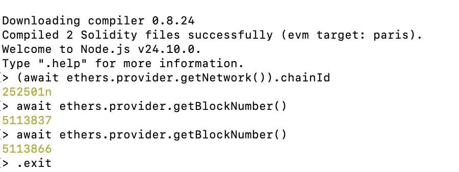

# Activity 12 — DIDLab Connection Verification

I successfully connected our Hardhat project to the DIDLab blockchain 

After opening the Hardhat console, I checked the network’s chain ID. The returned value was `252501n`, which confirmed that the project was connected to the correct DIDLab network. 

 Then checked the current block number twice. The second block number was higher than the first, confirming that the blockchain was active and continuing to produce new blocks. i was concerned about the two block number being not consecutive but later got it that there was time difference so  multiple block requestes were performeed in the meantime.

No private key was required because this activity only involved reading public blockchain information and did not make any changes to the network.

## Evidence
